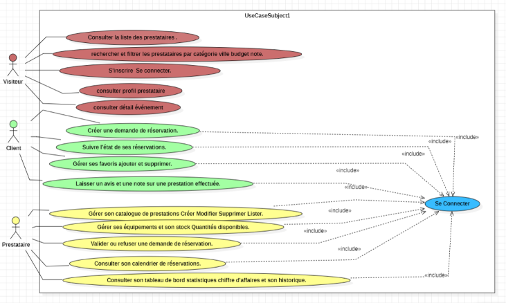
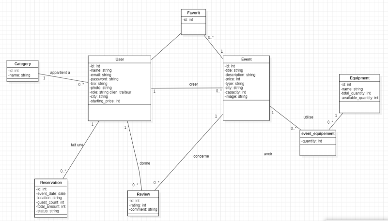
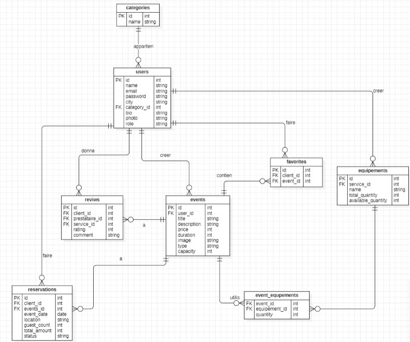

# 🎉 EventHub

<p align="center">
  <strong>Plateforme intelligente de gestion des prestations événementielles</strong>
</p>

<p align="center">
  Une application web Full Stack développée avec Laravel, React, MySQL et Tailwind CSS.
</p>

<p align="center">
  
  
  
  
</p>

---

## 📌 À propos du projet

**EventHub** est une plateforme web qui facilite la mise en relation entre les clients et les prestataires du domaine événementiel.

L'objectif est de centraliser les prestations événementielles sur une seule plateforme et de simplifier la recherche, la réservation et la gestion des services.

La plateforme permet notamment de gérer plusieurs catégories de prestataires :

- 🍽️ Traiteur
- 📷 Photographe
- 🎨 Décoration
- 🎧 DJ
- 🪑 Matériel
- 🎂 Pâtisserie

Les clients peuvent rechercher des offres, consulter les profils des prestataires, effectuer des réservations, gérer leurs favoris et laisser des avis.

Les prestataires disposent de leur propre espace pour gérer leurs événements, leurs équipements, leur stock, leur profil et les réservations reçues.

---

## ✨ Fonctionnalités principales

### 👤 Visiteur

Un visiteur peut :

- Consulter les événements disponibles
- Rechercher et filtrer les offres
- Consulter le détail d'un événement
- Consulter le profil public d'un prestataire
- Consulter les prestataires les mieux notés
- Créer un compte
- Se connecter

### ❤️ Client

Un client connecté peut :

- Créer une demande de réservation
- Consulter ses réservations
- Suivre le statut de ses demandes
- Ajouter un événement aux favoris
- Supprimer un événement des favoris
- Consulter ses favoris
- Laisser une note et un commentaire

### 🏢 Prestataire

Un prestataire peut :

- Gérer son profil
- Créer un événement
- Modifier un événement
- Supprimer un événement
- Consulter ses événements
- Gérer ses équipements
- Gérer les quantités du stock
- Consulter les réservations reçues
- Accepter une réservation
- Refuser une réservation

---

## 🧠 Gestion intelligente des réservations

L'une des fonctionnalités principales d'**EventHub** est la vérification automatique des disponibilités avant la création d'une réservation.

### 📅 Vérification des dates

Pour les prestataires autres que les traiteurs, une date est bloquée lorsqu'une réservation non refusée existe déjà pour le même prestataire.

Cela permet d'éviter que plusieurs clients réservent le même prestataire pour la même date.

Une réservation avec le statut `rejected` ne bloque pas la date.

### 🪑 Vérification du stock du traiteur

Pour les traiteurs, plusieurs réservations peuvent être acceptées pendant la même journée si le stock disponible est suffisant.

Le système applique actuellement les règles suivantes :

```text
1 invité = 1 chaise
1 table = 10 invités
```

Avant de créer une réservation, EventHub vérifie les réservations existantes et calcule les équipements déjà utilisés.

Si le stock restant n'est pas suffisant, la réservation est refusée avec un message explicatif.

### 💰 Calcul du montant

Le montant d'une réservation est calculé automatiquement :

```text
Montant total = Prix de l'événement × Nombre d'invités
```

---

## 🎯 User Stories

| ID | Acteur | User Story |
|---|---|---|
| US01 | Visiteur | Consulter les événements disponibles |
| US02 | Visiteur | Rechercher et filtrer les offres |
| US03 | Visiteur | Consulter le détail d'un événement |
| US04 | Visiteur | Consulter le profil d'un prestataire |
| US05 | Visiteur | S'inscrire et se connecter |
| US06 | Client | Créer une demande de réservation |
| US07 | Client | Consulter et suivre ses réservations |
| US08 | Client | Ajouter ou supprimer des favoris |
| US09 | Client | Laisser une note et un commentaire |
| US10 | Prestataire | Créer, modifier et supprimer ses événements |
| US11 | Prestataire | Gérer ses équipements et son stock |
| US12 | Prestataire | Consulter les réservations reçues |
| US13 | Prestataire | Accepter ou refuser une réservation |
| US14 | Prestataire | Modifier son profil |
| US15 | Système | Vérifier automatiquement la disponibilité |
| US16 | Système | Vérifier le stock nécessaire pour une réservation |

---

## 🛠️ Technologies utilisées

### Back-end

| Technologie | Utilisation |
|---|---|
| Laravel | API REST |
| Laravel Sanctum | Authentification |
| Eloquent ORM | Gestion des données |
| MySQL | Base de données |

### Front-end

| Technologie | Utilisation |
|---|---|
| React | Interface utilisateur |
| Vite | Environnement de développement |
| React Router | Navigation |
| Tailwind CSS | Design |
| Fetch API | Communication avec l'API |

### Outils

| Outil | Utilisation |
|---|---|
| Git | Gestion des versions |
| GitHub | Hébergement du repository |
| Postman | Test des API |
| XAMPP | Environnement local |
| VS Code | Développement |

---

## 🏗️ Architecture du projet

Le projet est séparé en deux parties principales :

```text
EventHub-V3/
│
├── eventhub-backend/
│   ├── app/
│   │   ├── Http/
│   │   │   └── Controllers/
│   │   └── Models/
│   ├── database/
│   │   ├── migrations/
│   │   └── seeders/
│   └── routes/
│       └── api.php
│
├── eventhub-frontend/
│   └── src/
│       ├── components/
│       ├── data/
│       ├── features/
│       │   ├── auth/
│       │   ├── client/
│       │   ├── events/
│       │   ├── home/
│       │   └── traiteur/
│       ├── routes/
│       └── services/
│
├── docs/
│   └── diagrams/
│       ├── use-case.png
│       ├── class-diagram.png
│       └── erd.png
│
└── README.md
```

---

# 📊 Conception UML

La conception de l'application est représentée à travers trois diagrammes principaux.

## 👥 Diagramme de cas d'utilisation

Ce diagramme représente les principales interactions entre les acteurs et la plateforme EventHub.

<p align="center">
  
</p>

---

## 🧩 Diagramme de classes

Le diagramme de classes représente les principales entités de l'application ainsi que leurs relations.

<p align="center">
  
</p>

---

## 🗄️ Diagramme ERD

Le diagramme ERD représente la structure de la base de données et les relations entre les différentes tables.

<p align="center">
  
</p>

---

## 🗃️ Modèle de données

Les principales entités utilisées dans l'application sont :

```text
User
Category
Event
Equipment
Reservation
Review
Favorite
event_equipment
```

### Relations principales

```text
Category
   │
   ▼
User (Prestataire)
   │
   ├──────────────► Event
   │                  │
   │                  ├────► Reservation
   │                  ├────► Review
   │                  └────► Favorite
   │
   └──────────────► Equipment

Event ◄──── event_equipment ────► Equipment
```

---

## 🔐 Authentification et sécurité

L'authentification de l'API est gérée avec **Laravel Sanctum**.

Après la connexion, l'application utilise le rôle de l'utilisateur pour gérer les redirections et les accès.

Les routes privées React sont protégées avec `ProtectedRoute`.

```text
Visiteur
   │
   └── Connexion
          │
          ├── Client ──────► Espace client
          │
          └── Prestataire ─► Dashboard prestataire
```

Les routes privées Laravel utilisent :

```php
auth:sanctum
```

---

## 🔌 API REST

### Routes publiques

```http
POST /api/register
POST /api/login

GET /api/events
GET /api/events/{id}

GET /api/prestataires/{id}
GET /api/top-prestataires

GET /api/events/{id}/reviews
```

### Routes protégées

Les fonctionnalités privées sont accessibles après authentification :

```text
/api/events
/api/my-events
/api/reservations
/api/equipment
/api/reviews
/api/favorites
/api/profile
```

---

## 🚀 Installation du projet

### 1. Cloner le repository

```bash
git clone https://github.com/SimoBnz1/EvenHub-V2.git
cd EvenHub-V2
```

### 2. Installer le Back-end

```bash
cd eventhub-backend
composer install
```

Créer le fichier `.env` :

```bash
cp .env.example .env
```

Sous Windows, tu peux également copier manuellement `.env.example` et le renommer en `.env`.

Configurer ensuite MySQL :

```env
DB_CONNECTION=mysql
DB_HOST=127.0.0.1
DB_PORT=3306
DB_DATABASE=eventhub
DB_USERNAME=root
DB_PASSWORD=
```

Générer la clé Laravel :

```bash
php artisan key:generate
```

Exécuter les migrations :

```bash
php artisan migrate
```

Ajouter les catégories :

```bash
php artisan db:seed --class=CategorySeeder
```

Créer le lien pour les images :

```bash
php artisan storage:link
```

Démarrer l'API :

```bash
php artisan serve
```

API Laravel :

```text
http://127.0.0.1:8000
```

### 3. Installer le Front-end

Ouvrir un deuxième terminal :

```bash
cd eventhub-frontend
npm install
npm run dev
```

Application React :

```text
http://localhost:5173
```

---

## 🧪 Tests réalisés

Les principales fonctionnalités testées pendant le développement :

- ✅ Inscription
- ✅ Connexion
- ✅ Gestion des événements
- ✅ Gestion des équipements
- ✅ Création d'une réservation
- ✅ Vérification de la capacité
- ✅ Vérification des conflits de date
- ✅ Vérification du stock du traiteur
- ✅ Acceptation et refus des réservations
- ✅ Gestion des favoris
- ✅ Avis et notes
- ✅ Profil prestataire
- ✅ Protection des routes

---

## 🌿 Git Workflow

Le développement du projet a été organisé avec plusieurs branches :

```text
main
│
├── feature/AuthPage
├── feature/EventManagement
└── feature/ReservationManagement
```

Les différentes fonctionnalités ont été développées séparément puis intégrées dans `main` avec des Pull Requests.

---

## 📁 Documentation

Les diagrammes de conception sont disponibles dans :

```text
docs/diagrams/
```

```text
docs/diagrams/
├── use-case.png
├── class-diagram.png
└── erd.png
```

---

## 👨‍💻 Auteur

**BEN IZZA Mohamed**

Développeur Web Full Stack

---

## 📌 Conclusion

**EventHub** permet de centraliser la gestion des prestations événementielles dans une seule application.

La plateforme facilite la mise en relation entre les clients et les prestataires tout en proposant des fonctionnalités de réservation, de gestion des événements, des équipements, des favoris, des avis et des profils prestataires.

Le système de vérification des disponibilités et du stock permet également de réduire les conflits de réservation et d'améliorer la gestion des prestations.